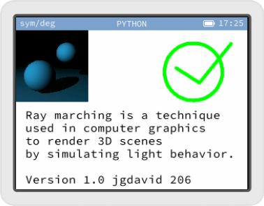

# Raymarching for Numworks
A small raymarching engine for Numworks.

### Use
1. Go to https://my.numworks.com/python/jgdavid/jgdavid206
2. Plug your calculator in
3. Press the `Load to calculator` button

### Documentation
You can read more about the script in the `docs` folder.
